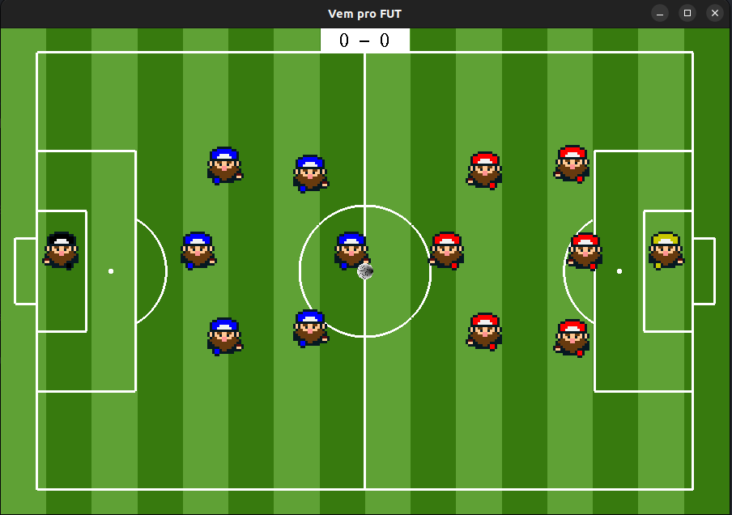

## Descrição do Projeto

Este projeto foi desenvolvido como parte da avaliação parcial da disciplina de Computação Gráfica na Universidade Federal de Alagoas (UFAL). O objetivo principal é aplicar conceitos fundamentais de computação gráfica, utilizando ferramentas e técnicas para criar uma aplicação visualmente interativa e funcional.

O projeto explora tópicos como renderização, transformações geométricas, manipulação de imagens e outros conceitos essenciais da área. Ele foi projetado para demonstrar o aprendizado e a aplicação prática dos conteúdos abordados em sala de aula.

### Funcionalidades

- **Movimentação de Jogadores**: Os jogadores podem ser controlados individualmente, permitindo movimentação fluida e responsiva dentro do ambiente do jogo.
- **Movimentação da Bola com o Teclado**: A bola pode ser movimentada utilizando comandos específicos do teclado, proporcionando maior interatividade.
- **Colisão de Jogadores**: Implementação de detecção de colisão entre os jogadores, garantindo uma experiência mais realista e dinâmica.
- **Sons de Background**: O jogo conta com uma trilha sonora de fundo para criar uma atmosfera imersiva.
- **Sons de Gol e Reinício de Jogo**: Efeitos sonoros são reproduzidos ao marcar um gol e ao reiniciar a partida, adicionando um toque de realismo e diversão.

Estas funcionalidades foram desenvolvidas para oferecer uma experiência completa e envolvente, destacando os conceitos aprendidos na disciplina.

Imagem de exemplo do programa:

  

